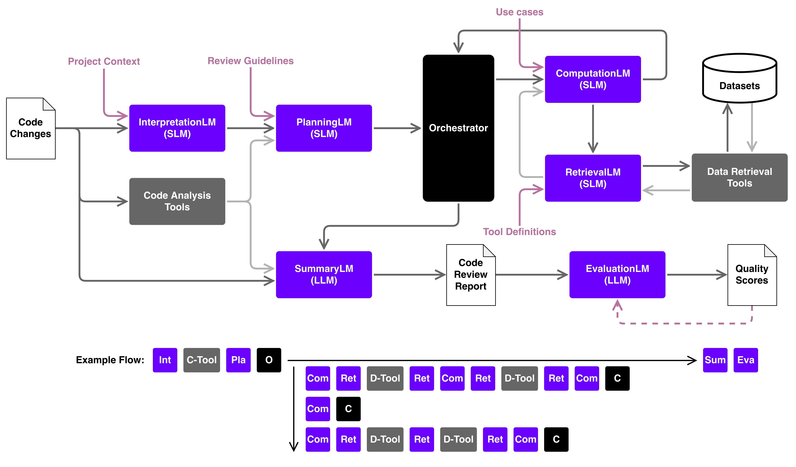

# Intelligent Code Review RAG Application

Project for Software Engineering Lab.  
Detail: https://drive.google.com/file/d/1ROs21oOD5hAumyx3W9JTEB31CfwmOUw5/view?usp=share_link


# Run
Prerequisites:
- Java 17+
- Docker and Docker Compose
- llama.cpp and llama-swap

To run the application, follow these steps:
- Make sure llama.cpp and llama-swap is installed.
- Start llama-swap `llama-swap -config llama-swap.yml -listen localhost:8080`.
- Start the FAISS and MariaDB services using `docker-compose up -d`.
- Run the application using `./run.sh`.

> [!NOTE]
> You can use the pre-extracted test data at `_backups/` to run the RAG application without running the ETL pipeline.  
> Place `.index` file under `./faiss_service/app/data` and import `.sql` file to MariaDB.  
> For example, run the following to import DB.  
> ```sh
> docker exec -i mariadb mariadb -u user -p123 ragdb < ragdb_backup.sql
> ```

# Configuration
- Set FAISS and MariaDB configurations in `docker-compose.yml`.
  - The index file of FAISS is stored in `./faiss_service/app/data`.
  - The database data is stored in docker volume, you can backup it via:
    ```sh
    docker exec mariadb mariadb-dump -u root -proot123 ragdb > ragdb_backup.sql
    ```
- Set spring app properties at `application.properties`.
- Set datasets and code review configurations at `application.yml`.
- Set llama-swap configuration at `llama-swap.yml`.
- Set environment variables at `.env` file.
  ```sh
  export DB_USERNAME="user"
  export DB_PASSWORD="123"
  export GOOGLE_GEMINI_API_KEY="???"
  ```


# Structure
- `_datasets/`: Datasets for ETL. (you need to prepare it by yourself)
- `faiss_service/`: FAISS vector store service implemented in Python Flask.
- `spring-app/`: Spring Boot application for ETL and RAG.
- `models/`: LLM and embedding model files.

## Spring APP

## Database Schema


# Common Problems
#### Can not find JAVA_HOME (Windows)
1. Set `JAVA_HOME` in System Environment Variables, e.g. `C:\Program Files\Java\jdk-xx `
2. Please use git bash instead of WSL bash/sh in powershell (WSL bash cannot find your JAVA_HOME)，add git bash in `PATH` System Environment Variables, e.g. `C:\Program Files\Git\bin`

# Design Concepts

## Database Tables
- `TrackRoot`: represents a specific folder or file that we want to track.
  - A `TrackRoot` can be configure with `allowed_source_types` defines what type of data source to be included when tracking. 
- `Source`: represents a specific file that we want to extract data from.
- A `Context` is a paragraph of meaningful text.
  - It can be an entire Java class, a paragraph in a document, or some defined structure.
  - The retrieval result is a list of `Context`.
- A `Chunk` is a smaller paragraph of text that is stored in a vector database as embedding.
  - The similarity search result is a list of `Chunk`.
- A `ChunkCollection` is a collection of `Chunk` that represents a specific scope of data.
  - The retrieval is performed on `ChunkCollection` level, which means the only the `Chunk` within the `ChunkCollection` is considered when performing retrieval.

### Avaliable ChunkCollections
- `project-context` including all source code and internal documentations of the project.
- `docs` including all internal documentations and all external knowledge.
- `guidelines` including all code review guidelines.
- `usecases` including all use cases on how to perform specific code review checks.
- `tool-definitions` including all tool API specifications.


## Multi-Agent Code Review


- **InterpretationLM**: Code Changes + (RAG) Project Context → Code Interpretation
- **PlanningLM**: Code Interpretation + Code Analysis + (RAG) Review Guidelines → Checklist
  - A checklist states items that need to be check during the review
- **ComputationLM**: Code Changes + Checklist Item → Item Answer
  - If current data is not enough, it delegate a query to RetrievalLM.
- **RetrievalLM**: Data Query + Tool Definitions → Tool Requests
  - After received tool responses, it evaluates whether the responses satisfied the query.
  - If the responses is determined to satisfy the query, send it back to the ComputationLM; otherwise, call tools again.
- **SummaryLM**: Code Changes + Code Analysis + Item Answers → Code Review Report
- **EvaluationLM**: Code Changes + Code Review Report → Quality Scores
  