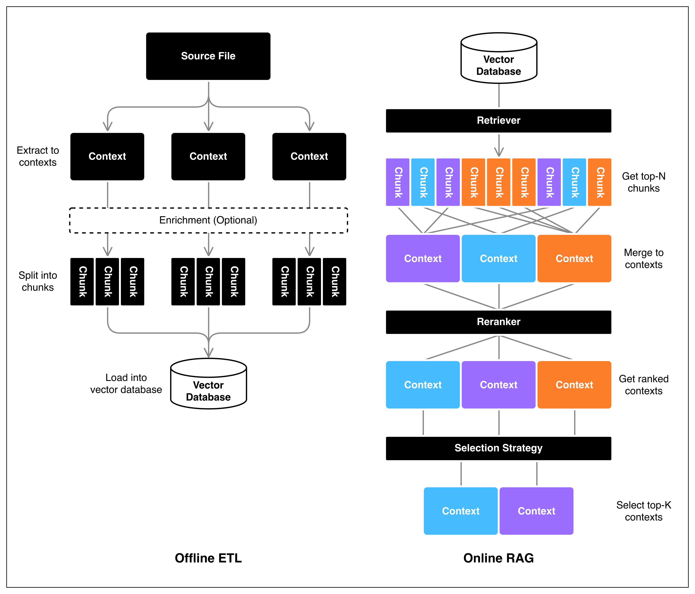

# Intelligent Code Review Application

Project for Software Engineering Lab.


## Project Structure
```
llmcr/
├── docker-compose.yml
├── llama-swap.yml
├── data/                       # Data preparation scripts
├── faiss_service/              # Python FAISS microservice
├── models/                     # .gguf files
├── logs/
├── spring-app/
│   ├── resources/
│   │   ├── application.properties   # Application config
│   │   └── application.yml          # ETL input data config
│   └── java/com/llmcr/
│       ├── LlmcrApplication.java
│       ├── agent/                   # Agents
│       ├── client/                  # LLM, embedding, reranking clients
│       ├── config/
│       ├── entity/                  # JPA entities
│       ├── rag/                     # RAG components
│       ├── repository/              # Spring Data repositories
│       ├── runner/                  # Application entrypoints
│       ├── service/
│       │   ├── etl/                 # ETL pipeline
│       │   ├── review/              # Code review service
│       │   ├── sync/                # Sync service
│       ├── tool/                    # Tools for agent tool calling
│       ├── util/
│       └── vectorstore/             # Vector database
├── _datasets/
└── _backups/                  # Pre-built index & DB dump
```

### Important Classes
- `agent/`: Agent implementations
- `rag/retrieve/QueryContextRetriever.java`: RAG retriever that retrieves relevant contexts based on input query
- `vectorstore/MyVectorStore.java`: The interface for a vector store that can be used for storing and retrieving chunks
- `service/etl/ETLPipeline.java`: ETL pipeline entrypoint
- `service/review/CodeReviewService.java`: Code review service entrypoint
- `service/sync/SyncService.java`: Sync service entrypoint


# Design Concepts

## Multi-Agent Code Review Workflow


### Agents
#### Interpretation Agent
- Input: Code Changes + (RAG) Project Context
- Output: Code Interpretation (change description + change motivation)

#### Planning Agent
- Input: Code Changes + Code Interpretation + Code Analysis + (RAG) Review Guidelines
- Output: Checklist

#### Computation Agent
- Input: Code Changes + Checklist Item + Previous Analysis (if have) + Previous Retrieval Result (if have) + (RAG) Related Use Cases
- Output: Item Answer
    - If current data is not enough, it output a query to Retrieval Agent.

#### Retrieval Agent
- Input: Data Query + (Fixed) Tool Definitions
- Output: Tool Requests
    - After received tool responses, it evaluates whether the responses satisfied the query.
    - If the responses is determined to satisfy the query, send it back to the Computation Agent; otherwise, call tools again.

#### Summary Agent
- Input: Code Changes + Code Analysis + Item Answers
- Output: Code Review Report

#### Evaluation Agent (Not Implement Now)
- Input: Code Changes + Code Review Report
- Output: Quality Scores

## Data Schema
- `TrackRoot`: represents a specific folder or file that we want to track.
  - A `TrackRoot` can be configure with `allowed_source_types` defines what type of data source to be included when tracking.
- `Source`: represents a specific file that we want to extract data from.
- A `Context` is a paragraph of meaningful text.
  - It can be an entire Java class, a paragraph in a document, or some defined structure.
  - The retrieval result is a list of `Context`.
- A `Chunk` is a smaller paragraph of text that is stored in a vector database as embedding.
  - The similarity search result is a list of `Chunk`.
- A `ChunkCollection` is a collection of `Chunk` that represents a specific scope of data.
  - The retrieval is performed on `ChunkCollection` level, which means the only the `Chunk` within the `ChunkCollection` is considered when performing retrieval.

### Avaliable ChunkCollections
- `project-context` including all source code and internal documentations of the project.
- `docs` including all internal documentations and all external knowledge.
- `guidelines` including all code review guidelines.
- `usecases` including all use cases on how to perform specific code review checks.

## ETL and RAG


ETL pipeline and RAG workflow illustration. The ETL pipeline is responsible for extracting data from various sources, processing it into `Context`, and storing it in the vector database as `Chunk`. The RAG workflow retrieves relevant `Chunk` from the vector database based on the input query, and use them as additional context for agents to generate answer.


# Quick Start
Prerequisites:
- Java 17+
- Docker and Docker Compose
- llama.cpp and llama-swap

## Configuration
- Set FAISS and MariaDB configurations in `docker-compose.yml`.
  - The index file of FAISS is stored in `faiss_service/app/data`.
  - The database data is stored in docker volume
- Set spring app properties at `spring-app/src/main/resources/application.properties`.
- Set datasets and code review configurations at `spring-app/src/main/resources/application.yml`.
- Download and place `.gguf` model files under `models/` folder.
  - [Phi-4-mini-instruct](https://huggingface.co/aathaval/Phi-4-mini-instruct-Q6_K-GGUF/blob/main/phi-4-mini-instruct-q6_k.gguf)
  - Reasoning SLM: [LFM2.5-1.2B-Thinking](https://huggingface.co/LiquidAI/LFM2.5-1.2B-Thinking-GGUF/blob/main/LFM2.5-1.2B-Thinking-Q8_0.gguf)
  - Embedding Model: [harrier-oss-v1-0.6b](https://huggingface.co/mradermacher/harrier-oss-v1-0.6b-GGUF/blob/main/harrier-oss-v1-0.6b.Q4_K_M.gguf)
- Set llama-swap configuration at `llama-swap.yml`.
- Set environment variables at `.env` file.
  ```sh
  export DB_USERNAME="user"
  export DB_PASSWORD="123"
  export GOOGLE_GEMINI_API_KEY="???"
  ```

## Run the Application
Follow these steps:
- Make sure [llama.cpp](https://github.com/ggml-org/llama.cpp) and [llama-swap](https://github.com/mostlygeek/llama-swap) is installed.
- Start llama-swap
```bash
llama-swap -config llama-swap.yml -listen localhost:8080
```
- Start the FAISS and MariaDB services
```
docker-compose up -d
```
- Then `cd spring-app/` and run the following shell scripts:
  - `run.sh`: Run the application with specified runner.
  - `review.sh`: Run the code review service.

> [!NOTE]
> You can access the pre-extracted test data [HERE](https://drive.google.com/file/d/1zy6l341eKZVn6dqB9GpuedcZ8ga2hvyZ/view?usp=drive_link) to run the application without running the ETL pipeline.
>
> You will see `.index` files under `faiss/` and an `ragdb_backup.sql`
> 1. Import `ragdb_backup.sql` file to MariaDB use `docker exec -i mariadb mariadb -u user -p123 ragdb < ragdb_backup.sql`
> 2. Place `.index` file under `./faiss_service/app/data`
> or you can run the `runner/ReloadChunkRunner` to reload all index to FAISS service.
>
> You can backup the database via: `docker exec mariadb mariadb-dump -u root -proot123 ragdb > ragdb_backup.sql`

> [!Warning]
> If you want to run the ETL pipeline with the pre-extracted data, download the datasets in section [Datasets used](#datasets-used). And place the unzipped files under `./_datasets/` folder, and make sure the path configuration in `application.yml` is correct.


# Datasets used
[Download Datasets](https://drive.google.com/file/d/1CJLv8RLnf7EOtlpXyMEK07S8RFMN3Wk1/view?usp=drive_link)

- Project Context: Spring AI [release 2.0.0-M1](https://github.com/spring-projects/spring-ai/releases/tag/v2.0.0-M1)
- Review Guidelines:
  - https://google.github.io/eng-practices/review/reviewer/standard.html
  - https://docs.gitlab.com/development/code_review/
  - Some handwritten documents
- Use Cases:
  - Use GPT-5.5 to generate example computation responses from selected pull requests, validated by myself
    - https://github.com/spring-projects/spring-ai/pull/5934
  - Total 14 usecase
    - 4 need additional data, 4 with Yes final answer, 6 with No final answer
- Tool Definitions:
  - refer to `spring-app/src/main/java/com/llmcr/tool`
- Other datasets:
  - SE documents: Effective Java 3rd Edition by Joshua Bloch


# Common Problems
#### Can not find JAVA_HOME (Windows)
1. Set `JAVA_HOME` in System Environment Variables, e.g. `C:\Program Files\Java\jdk-xx `
2. Please use git bash instead of WSL bash/sh in powershell (WSL bash cannot find your JAVA_HOME)，add git bash in `PATH` System Environment Variables, e.g. `C:\Program Files\Git\bin`
