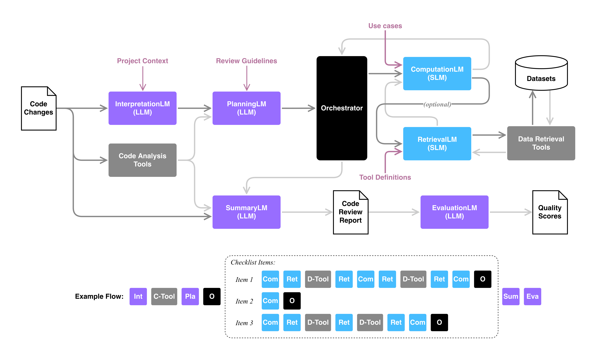

# Intelligent Code Review RAG Application

Project for Software Engineering Lab.  
Detail: https://drive.google.com/file/d/1ROs21oOD5hAumyx3W9JTEB31CfwmOUw5/view?usp=share_link


# Run
Prerequisites:
- Java 17+
- Docker and Docker Compose
- llama.cpp and llama-swap

To run the application, follow these steps:
- Make sure llama.cpp and llama-swap is installed.
- Start llama-swap `llama-swap -config llama-swap.yml -listen localhost:8080`.
- Start the FAISS and MariaDB services using `docker-compose up -d`.
- Run the application using `./run.sh`.

> [!NOTE]
> You can use the pre-extracted test data at `_backups/` to run the RAG application without running the ETL pipeline.  
> Place `.index` file under `./faiss_service/app/data` and import `.sql` file to MariaDB.  
> For example, run the following to import DB.  
> ```sh
> docker exec -i mariadb mariadb -u user -p123 ragdb < ragdb_backup.sql
> ```

# Configuration
- Set FAISS and MariaDB configurations in `docker-compose.yml`.
  - The index file of FAISS is stored in `./faiss_service/app/data`.
  - The database data is stored in docker volume, you can backup it via:
    ```sh
    docker exec mariadb mariadb-dump -u root -proot123 ragdb > ragdb_backup.sql
    ```
- Set spring app properties at `application.properties`.
- Set datasets and code review configurations at `application.yml`.
- Set llama-swap configuration at `llama-swap.yml`.
- Set environment variables at `.env` file.
  ```sh
  export DB_USERNAME="user"
  export DB_PASSWORD="123"
  export GOOGLE_GEMINI_API_KEY="???"
  ```


# Structure
```
llmcr/
├── docker-compose.yml          # MariaDB + FAISS service containers
├── llama-swap.yml              # LLM model routing config (llama-swap)
├── faiss_service/              # Python FAISS microservice
├── spring-app/                 # Main Spring Boot application
│   ├── review.sh               # Entry point to trigger code review
│   └── src/main/
│       ├── resources/
│       │   ├── application.properties   # DB / model endpoint config
│       │   └── application.yml          # Dataset paths & review config
│       └── java/com/llmcr/
│           ├── LlmcrApplication.java
│           ├── entity/                  # JPA entities (TrackRoot, Source, Context, Chunk, …)
│           ├── repository/              # Spring Data repositories
│           ├── service/
│           │   ├── etl/                 # ETL pipeline (extract → split → enrich → load)
│           │   │   ├── ETLPipeline.java
│           │   │   ├── extractor/       # Per-source-type extractors
│           │   │   └── transformer/     # Splitters & enrichers
│           │   ├── rag/                 # RAG advisor & retrieval strategies
│           │   │   ├── RAGAdvisor.java
│           │   │   └── retrieval/       # Fusion & top-k selection
│           │   ├── review/              # Multi-agent code review workflow
│           │   │   ├── CodeReviewService.java
│           │   │   ├── agent/           # Interpretation / Planning / Computation / Retrieval / Summary agents
│           │   │   ├── workflow/        # Chain, parallelization & retrieval-loop orchestration
│           │   │   └── trace/           # Logging & trace collection
│           │   └── sync/               # Source sync service
│           ├── tool/
│           │   └── RetrievalMethods.java  # Tool definitions exposed to Retrieval Agent
│           ├── vectorstore/             # FAISS vector store adapter
│           └── client/                  # LLM / embedding / reranking clients
├── _datasets/                  # Raw data fed into ETL
├── _backups/                   # Pre-built index & DB dump
│   ├── ragdb_backup.sql
│   └── faiss/*.index
```


# Design Concepts

## Database Tables
- `TrackRoot`: represents a specific folder or file that we want to track.
  - A `TrackRoot` can be configure with `allowed_source_types` defines what type of data source to be included when tracking. 
- `Source`: represents a specific file that we want to extract data from.
- A `Context` is a paragraph of meaningful text.
  - It can be an entire Java class, a paragraph in a document, or some defined structure.
  - The retrieval result is a list of `Context`.
- A `Chunk` is a smaller paragraph of text that is stored in a vector database as embedding.
  - The similarity search result is a list of `Chunk`.
- A `ChunkCollection` is a collection of `Chunk` that represents a specific scope of data.
  - The retrieval is performed on `ChunkCollection` level, which means the only the `Chunk` within the `ChunkCollection` is considered when performing retrieval.

### Avaliable ChunkCollections
- `project-context` including all source code and internal documentations of the project.
- `docs` including all internal documentations and all external knowledge.
- `guidelines` including all code review guidelines.
- `usecases` including all use cases on how to perform specific code review checks.


## Multi-Agent Code Review Workflow


1. Interpretation Agent receives code changes and project context, and generates code interpretation including change description and change motivation.
2. Planning Agent receives code changes, code interpretation, code analysis and review guidelines, and generates a checklist of code review items.
3. For each checklist item, Computation Agent receives code changes, checklist item, previous analysis and previous retrieval result, and generates item answer. If the current data is not enough for answering the checklist item, it will generate a data query and send it to Retrieval Agent.
4. Retrieval Agent receives data query and tool definitions, and generates tool requests. After receiving tool responses, it evaluates whether the responses satisfied the query. If the responses is determined to satisfy the query, send it back to the Computation Agent; otherwise, call tools again until the query is satisfied.
5. Summary Agent receives code changes, code analysis and item answers, and generates code review report.
6. (Not Implement Now) Evaluation Agent receives code changes and code review report, and generates quality scores.

### Agents
#### Interpretation Agent
- Input: Code Changes + (RAG) Project Context
- Output: Code Interpretation (change description + change motivation)

#### Planning Agent
- Input: Code Changes + Code Interpretation + Code Analysis + (RAG) Review Guidelines
- Output: Checklist

#### Computation Agent
- Input: Code Changes + Checklist Item + Previous Analysis (if have) + Previous Retrieval Result (if have)
- Output: Item Answer
    - If current data is not enough, it output a query to Retrieval Agent.

#### Retrieval Agent
- Input: Data Query + (Fixed) Tool Definitions
- Output: Tool Requests
    - After received tool responses, it evaluates whether the responses satisfied the query.
    - If the responses is determined to satisfy the query, send it back to the Computation Agent; otherwise, call tools again.

#### Summary Agent
- Input: Code Changes + Code Analysis + Item Answers
- Output: Code Review Report

#### Evaluation Agent (Not Implement Now)
- Input: Code Changes + Code Review Report
- Output: Quality Scores

# TODO
- Write use cases

# Common Problems
#### Can not find JAVA_HOME (Windows)
1. Set `JAVA_HOME` in System Environment Variables, e.g. `C:\Program Files\Java\jdk-xx `
2. Please use git bash instead of WSL bash/sh in powershell (WSL bash cannot find your JAVA_HOME)，add git bash in `PATH` System Environment Variables, e.g. `C:\Program Files\Git\bin`
